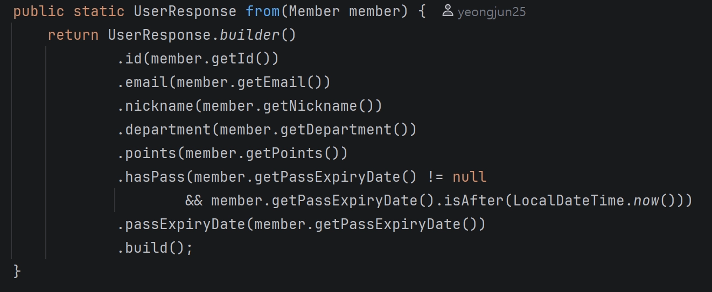

# Q1. 빌더 패턴이란?

객체지향 프로그래밍에서 복잡한 객체의 구성과 표현을 분리하여 다양한 종류의 객체를 생성할 수 있게 하는 디자인 패턴이다.
스프링에서 Lombok의 `@Builder` 어노테이션을 통해 빌더 패턴을 사용할 수 있다.

## 스프링에서 @Builder 패턴을 사용하는 이유

객체를 생성할 때 원래 방식대로라면, 아래 코드처럼 객체를 생성한다.

```java
User user = new User("제이", 25, "컴퓨터공학과", "인하대", null, "UMC");
```

하지만, 프로젝트 규모가 커지고 하나의 객체에 들어가는 데이터 값이 많아지는 상황에서는 위의 방식대로 했을 때 문제가 발생할 수 있다.
파라미터 순서가 안 맞거나, 데이터 타입을 잘못 넣을 수 있고, 결정적으로 각 파라미터가 엔티티의 어떤 필드에 대응되는지 직관적으로 알기가 어렵다.

이를 해결하기 위해 `@Builder` 어노테이션을 사용하고, 보통 DTO와 함께 자주 사용된다.

```java
User user = userRepository.findById(id);

UserResponse response = UserResponse.builder()
        .id(user.getId())
        .name(user.getName())
        .department(user.getDepartment())
        .univ(user.getUniv())
        .age(user.getAge())
        .build();
```

## 정리

### 장점
- 필드가 많아도 가독성이 좋다.
- 순서 상관이 없다.
- 원하는 필드만 선택적으로 세팅 가능하다.

### 단점
- 필드가 적은 경우에는 빌더 패턴 사용 시 코드가 더 길어진다.
- Lombok 없이 순수 구현하면 코드량이 많아진다. (빌더 클래스를 전부 만들어야 하기 때문)

---

# Q2. record vs static class

Java 16에서 정식으로 도입된 불변 데이터 클래스이다.

```java
public record UserResponse(Long id, String name) {}
```

위 `public record UserResponse` 선언 한 문장이 의미하는 것

- `private final` 필드 id, name 선언
- getter() 사용 가능
    - 단, `user.getId()` 방식이 아니라 `user.id()`, `user.name()` 이렇게 사용한다.
    - get 접두사가 없음
- 생성자 (`this.id = id`, `this.name = name` 초기화 불필요)
- `equals()`, `hashCode()`, `toString()` 메서드 사용 가능
- 상속 불가능
- 필드 추가 불가능

=> "**데이터를 담기만 하는 불변 객체**"

반면, static class는 필드 선언, getter 설정, 생성자 등 보일러플레이트가 필요하다.
그럼에도 불구하고 `@Valid`, `@Builder`를 사용할 수 있고(record는 사용 불가능),
필드 수정이 가능하다는 차이점이 존재한다.

결론적으로, record가 더 간결하고 보일러플레이트도 없고 깔끔하지만, 수정할 수 없다는 단점이 있고
상황에 맞게 static class와 record 둘 중 하나로 DTO를 선언할 때 사용하면 된다.

---

# Q3. 제네릭이란?

데이터 타입을 클래스 내부에서 지정하는 것이 아닌 외부에서 사용자에 의해 지정되는 것을 의미한다.
즉, **타입을 미리 정해두지 않고 데이터 호출 시점에 해당 타입이 결정된다.**

제네릭이 없을 때는 Object(모든 클래스의 최상위 부모 클래스) + 강제 형변환이 필요했다.
문제점은 잘못된 타입으로 형변환을 했을 때 컴파일 단계가 아닌 런타임 단계에서 에러가 발생하는 점이다.

실제 서비스가 돌아가다가 런타임에 에러가 터지면 치명적이다.
제네릭을 사용하면 **컴파일 단계에서** 에러를 확인할 수 있다는 장점이 있다.

```java
// 제네릭 사용 방법

public class Box<T> {
    private T value;

    public void set(T value) { this.value = value; }
    public T get() { return this.value; }
}

Box<String> box = new Box<>();
box.set("hello");
String value = box.get(); // (String)box.get() 형변환 불필요

box.set(123); // 컴파일 단계에서 에러 - 런타임 전에 잡힘
```

코드 속 `<T>`는 타입 파라미터 이름이다. 말 그대로 이름이기 때문에 T가 아닌 아무 단어나 들어가도 상관없다.
하지만 관례상 Type 앞글자를 따서 T라고 적는 것이 관례적이다.

타입을 변수처럼 다룬다고 생각하면 편하다. 변수도 사용하는(호출하는) 시점에 값을 넣고 다루기 때문이다.

```java
// Java에서 흔히 보이는 제네릭

List<String> list = new ArrayList<>();
Map<String, Integer> map = new HashMap<>();
Optional<User> user = userRepository.findById(id);
```

> 단, 제네릭이 에러를 없애주는 기능이라고 오해하면 안된다.
> 런타임 단계에서 발견될 에러를 컴파일 단계에서 발견할 수 있는 것이다.
> 또한, 타입이 명확할 때 제네릭을 굳이 사용할 필요는 없다. 오히려 코드만 복잡해지기 때문이다.

---

# Q4. @RestControllerAdvice란?

`@ControllerAdvice` + `@ResponseBody`가 합쳐진 어노테이션이다.

- `@ResponseBody`: 클라이언트의 리턴값을 JSON으로 변환해서 Response Body에 담아라.
- `@ControllerAdvice`: 예외처리 후 리턴값을 기준으로 동일한 이름의 뷰를 찾아라.

두 어노테이션이 합쳐진 `@RestControllerAdvice`는 어느 컨트롤러에서 예외가 터지든 한 곳에서 전역으로 처리해준다.
원래는 각 서비스 계층에서 발생한 예외를 각 컨트롤러마다 직접 다뤘다.
이렇게 되면 컨트롤러가 100개면 예외 처리 코드도 100번 반복되는 것이다.

```java
@RestControllerAdvice
public class GlobalExceptionHandler {

    @ExceptionHandler(UserNotFoundException.class)
    public ApiResponse<String> handleUserNotFound(UserNotFoundException e) {
        return ApiResponse.onFailure(ErrorCode.USER_NOT_FOUND, e.getMessage());
    }

    @ExceptionHandler(IllegalArgumentException.class)
    public ApiResponse<String> handleIllegalArgument(IllegalArgumentException e) {
        return ApiResponse.onFailure(ErrorCode.INVALID_INPUT, e.getMessage());
    }

    // 나머지 모든 예외는 여기서 처리
    @ExceptionHandler(Exception.class)
    public ApiResponse<String> handleException(Exception e) {
        return ApiResponse.onFailure(ErrorCode.INTERNAL_SERVER_ERROR, e.getMessage());
    }
}
```

`UserNotFoundException`, `IllegalArgumentException` 두 예외가 터지면
`@ExceptionHandler`가 가로채서 예외 처리 진행한다.

> **특징**: `@RestControllerAdvice`를 쓸거면 모든 예외를 등록해놔야 한다.
> 등록 안 된 예외는 보통 `Exception.class`에서 전부 처리한다.

---

# Q5. Optional이란?

Optional이란 **null일 수도 있는 값을 감싸는 컨테이너 역할**을 한다.
Java에서 가장 흔히 발생하는 에러 중 하나가 **NullPointerException**이다.
특정 메서드의 리턴값이 null일 수도 아닐 수도 있는 상황에서는 Optional을 통해 해결할 수 있다.

1. 명시적으로 "여기 null값이 들어갈 수도 있구나"를 빠르게 파악할 수 있다.
2. Optional로 감싼 객체에 직접 접근이 불가능해진다. => NPE 방지 목적

NPE가 발생하는 이유는, 해당 객체가 null값인지 모른 채 접근하는 상황 때문이다.
컴파일러는 null 체크를 강요하지 않기 때문이다.
따라서, null값이 들어올 수 있는 객체는 Optional 메서드를 통해 null처리를 반드시 거친 후 접근하도록 강제하는 것이다.

```java
public interface MemberRepository extends JpaRepository<Member, Long> {

    Optional<Member> findByEmail(String email);
    Optional<Member> findByEmailAndPhoneNumber(String email, String phoneNumber);
    Optional<Member> findByPhoneNumber(String phoneNumber);
}

Member member = memberRepository.findByEmail(email)
                .orElseThrow(() -> new IllegalArgumentException("존재하지 않는 회원입니다."));
```

---

