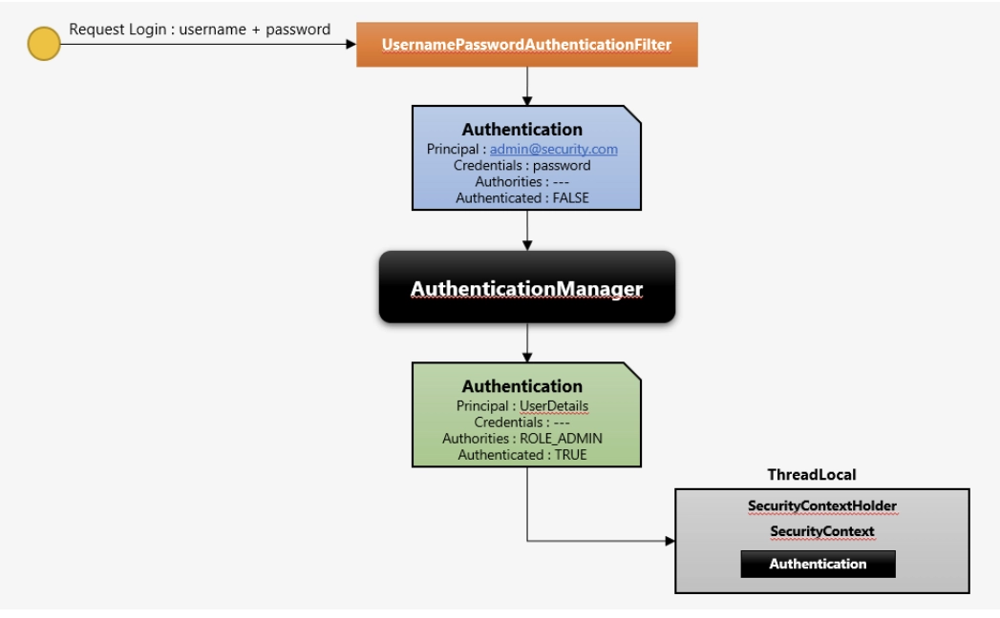
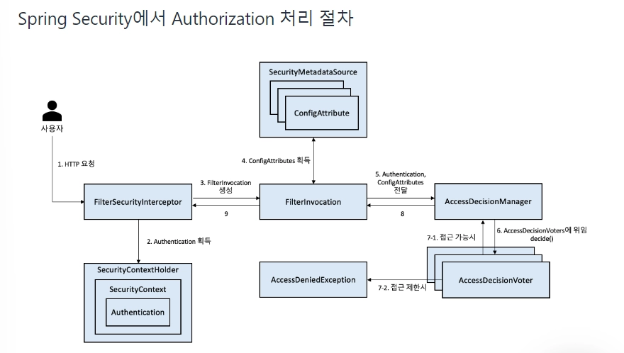

# Q1. Spring Security가 무엇인가?

## 정의

인증(Authentication)과 인가(Authorization)를 관리하는 보안 프레임워크이다.

## 왜 쓰는가

일반적으로 웹 어플리케이션에서는 사용자 인증, 권한 부여(인가), 공격 방어(CSRF, XSS, CORS) 등의 다양한 보안 요구 사항이 필요하다.

- 개발자가 전부 하나하나 구현하면 실수할 가능성이 있다. (+ 허점 발생)
- 반복적인 코드를 작성해야 한다.
- Spring Security를 통해 검증된 보안 기능을 제공하여 개발자가 핵심 로직 구현에 집중할 수 있게 해준다.

## 동작 원리

Spring Security는 **서블릿 필터 체인(`FilterChainProxy`)** 을 기반으로 동작한다. 클라이언트 요청이 Controller(`DispatcherServlet`)에 도달하기 전에, 여러 보안 필터를 순서대로 거치며 인증·인가가 처리된다. 개발자는 이 필터 체인을 설정하는 방식으로 보안을 구성한다.

> 핵심은 **Controller에 도달하기 전에 보안 필터가 인증·인가 처리를 수행**한다는 것이다.

ex) `UsernamePasswordAuthenticationFilter` ⇒ 사용자의 ID, PW를 검증한다.

## 주요 기능

1. **인증(Authentication)**: 사용자의 신원을 확인하는 과정이다. ex) 로그인 / 토큰 인증
2. **인가(Authorization)**: 사용자가 특정 자원에 접근할 수 있는 권한을 관리한다. (로그인 이후)
3. **암호화(Encryption)**: 비밀번호 등의 민감한 데이터를 안전하게 저장할 수 있도록 기능을 제공한다.
4. **세션 관리**: 세션 고정 공격 방어, 동시 세션 제어 등의 기능을 제공한다.
5. **공격 방어**: CSRF, XSS, 세션 하이재킹 등 웹 공격을 방어하는 기능을 제공한다.
6. **OAuth2 및 JWT 지원**

## 핵심 컴포넌트

- `SecurityFilterChain` — 보안 필터들의 묶음
- `AuthenticationManager` — 인증 처리의 핵심
- `SecurityContextHolder` — 인증된 사용자 정보(`Authentication`)를 보관
- `UserDetailsService` — 사용자 정보를 로드
---
# Q2. 인증(Authentication) vs 인가(Authorization)

## 인증 (Authentication)

> "당신은 누구십니까" — 신원 확인

신원을 확인하는 단계로, 보통 로그인, 토큰 인증 등의 과정에 해당한다.

### 예시

1. 로그인 화면에서 ID/PW 입력 → 일치하면 인증 성공
2. JWT 토큰을 헤더에 담아 요청 → 토큰이 유효하면 인증 성공

### Spring Security에서의 인증 흐름

1. 사용자가 username과 password를 입력하면 `UsernamePasswordAuthenticationFilter`가 request를 받는다.
2. Filter는 해당 정보로 `UsernamePasswordAuthenticationToken`(Authentication 객체)을 생성한다. 이 시점의 객체는 아직 인증되지 않은 상태다.
3. `AuthenticationManager`(구현체: `ProviderManager`)가 Authentication 객체를 받아 적절한 `AuthenticationProvider`에게 인증을 위임한다.
4. `AuthenticationProvider`는 `UserDetailsService`를 통해 DB에서 유저 정보를 로드한다.
5. 로드된 `UserDetails`와 사용자가 입력한 password를 비교해 검증한다.
6. 인증에 성공하면 권한 정보(GrantedAuthority)가 채워진 Authentication 객체를 반환한다.
7. 최종적으로 생성된 Authentication 객체는 `SecurityContextHolder` > `SecurityContext`에 저장되어 전역적으로 사용 가능하다.

- **실패 시**: `401 Unauthorized`
- **수행 빈도**: 보통 한 번(로그인 시)

## 인가 (Authorization)

> "당신은 무엇을 할 수 있습니까?" — 권한 확인

인증된 사용자가 특정 자원이나 기능에 접근할 권한이 있는지 확인하는 과정이다.

### 예시

1. 일반 사용자: 게시글 조회 기능 / 관리자: 게시글 삭제 기능
2. 내가 작성한 게시글: 수정/삭제 가능 / 남이 작성한 게시글: 조회만 가능

### Spring Security에서의 인가 흐름

1. 사용자가 HTTP 요청을 보낸다.
2. `FilterSecurityInterceptor`가 `SecurityContextHolder` > `SecurityContext`에서 `Authentication`(인증 정보)을 꺼낸다.
3. `FilterInvocation` 객체를 생성한다.
4. `SecurityMetadataSource`에서 요청한 자원에 필요한 권한 정보(`ConfigAttribute`)를 가져온다.
5. `Authentication`과 `ConfigAttributes`를 `AccessDecisionManager`에 전달한다.
6. `AccessDecisionManager`가 `decide()`를 호출해 `AccessDecisionVoter`들에게 판단을 위임한다.
7. Voter들의 투표 결과에 따라 — 접근 가능하면 통과(8-1), 접근 제한이면 `AccessDeniedException` 발생(8-2).
8. 결과값이 `FilterSecurityInterceptor`로 전달된다.

**최신 버전 기준 변경 사항**

- `FilterSecurityInterceptor` → 최신 버전에서는 `AuthorizationFilter`
- `AccessDecisionManager` / `AccessDecisionVoter` → `AuthorizationManager`
- `SecurityMetadataSource` → 별도 컴포넌트 없이 통합됨

- **실패 시**: `403 Forbidden`
- **수행 빈도**: 자원·요청마다 매번

## 인증과 인가의 관계

인증은 인가의 전제 조건이다. 인증이 먼저 수행되어야 인가가 가능하다.

인증은 `Authentication` 객체를 생성해 `SecurityContextHolder`에 **저장**하고, 인가는 그 객체를 **꺼내** 권한 판단의 재료로 쓴다.
---
# Q3. Stateful vs Stateless

## 1. Stateful (상태 유지)

서버가 클라이언트와의 통신 상태를 **계속 기억**한다. 이전 요청의 정보가 다음 요청에 영향을 준다.

### 특징

- 서버가 클라이언트별 상태 정보를 메모리나 저장소에 보관한다.
- 클라이언트는 매 요청마다 자신을 식별할 정보(ex. 세션 ID)만 보내면, 나머지 정보는 서버가 기억하고 있다.
- 같은 클라이언트의 요청은 항상 **같은 서버로 전달되어야 한다.** 상태가 그 서버에만 저장돼 있기 때문이다.

### 예시

- **세션 기반 로그인**: 로그인하면 서버가 세션을 만들어 사용자 정보를 저장하고, 클라이언트는 세션 ID(쿠키)만 들고 다닌다.
- TCP 연결

### 장점

- 클라이언트가 매번 모든 정보를 보낼 필요가 없어 요청이 가볍다.
- 서버가 맥락을 알고 있어 연속적인 작업 처리에 유리하다.

### 단점

- 서버가 상태를 저장하므로 메모리 부담이 크다.
- **확장성(Scalability)이 떨어진다.** 서버를 여러 대로 늘릴 때, 특정 서버에 저장된 상태를 다른 서버가 모른다. → 세션 불일치 문제
- 서버가 죽으면 저장돼 있던 상태도 함께 사라진다.

---

## 2. Stateless (무상태)

서버가 클라이언트의 상태를 저장하지 않는다. 요청 하나하나가 서로 독립적이라, 서버는 이전 요청을 기억할 필요가 없다.

### 특징

- 서버는 요청을 처리한 뒤 클라이언트 관련 정보를 남기지 않는다.
- 클라이언트는 매 요청마다 필요한 모든 정보(인증 토큰 등)를 함께 보내야 한다.
- 어느 서버가 요청을 처리해도 결과가 동일하다.

### 예시

- **JWT 토큰 기반 인증**: 서버가 세션을 저장하지 않고, 클라이언트가 매 요청에 토큰을 담아 보내면 서버는 토큰만 검증한다.
- HTTP 프로토콜 자체가 기본적으로 stateless하다.
- **REST API** (REST의 핵심 제약 조건 중 하나가 Stateless)

### 장점

- 서버가 상태를 저장하지 않아 메모리 부담이 적다.
- **확장성이 뛰어나다.** 어느 서버가 받아도 처리가 동일하므로 서버를 자유롭게 늘릴 수 있다(수평 확장에 유리).
    - 수강신청 / 콘서트 예매 등 일시적으로 트래픽이 몰릴 때 서버 확장에 유리하다.
- 서버 하나가 죽어도 다른 서버가 그대로 요청을 받을 수 있다.

### 단점

- 매 요청마다 필요한 정보를 모두 보내야 하므로 요청의 크기가 커진다.
- 클라이언트가 보낸 정보를 매번 검증해야 하는 부담이 있다.

---

## 3. 비교 표

| 항목 | Stateful | Stateless |
| --- | --- | --- |
| 상태 저장 | 서버가 저장 | 저장하지 않음 |
| 요청의 독립성 | 이전 요청에 의존 | 각 요청이 독립적 |
| 클라이언트가 보내는 정보 | 식별자만 (예: 세션 ID) | 매번 전체 정보 (예: 토큰) |
| 확장성(Scale-out) | 불리 | 유리 |
| 서버 메모리 부담 | 큼 | 작음 |
| 장애 대응 | 서버 다운 시 상태 손실 | 영향 적음 |
| 대표 예시 | 세션 기반 인증 | JWT 인증, REST API |

## 4. 실제 적용 예시

콘서트 예매 사이트는 WAS 서버 자체는 **stateless**하게 설계하고, 상태는 서버 밖으로 분리한다. 좌석 선점 같은 임시 상태는 **Redis**, 확정된 예매 정보는 **DB**에 저장한다. 이렇게 상태를 외부 공유 저장소로 빼면, 트래픽이 몰릴 때 서버를 자유롭게 늘려도 모든 서버가 같은 상태를 공유할 수 있다.