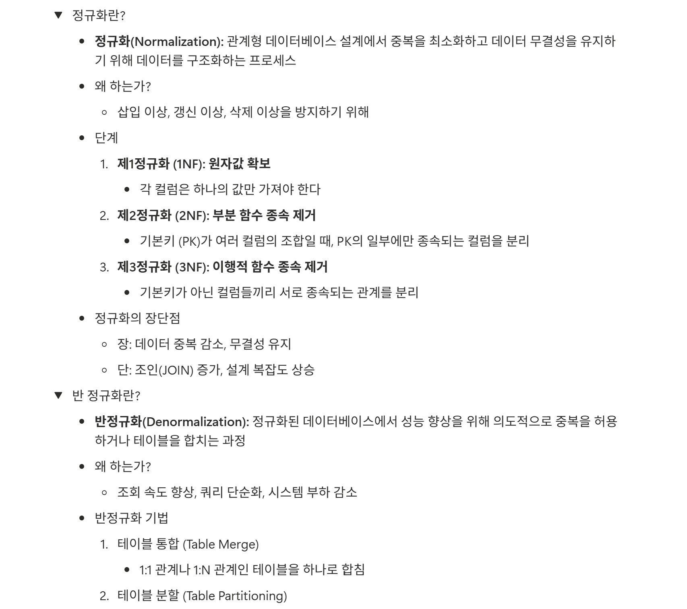
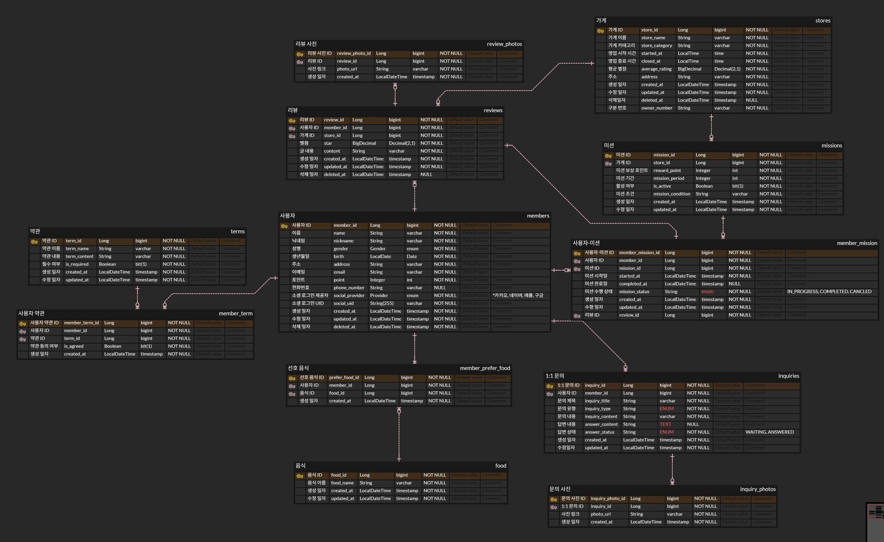

### 워크북 캡쳐 (spring C팀 제이->유리 워크북 피어리뷰)

### 워크북 리뷰

<aside>
🌟

데이터베이스의 핵심 기본 개념 중 정규화, 반 정규화에 대한 설명을 가독성 쉽게 잘 작성하였다고 생각한다. [정의 / 사용하는 이유 / 단계별 개념 정리 / 장단점] 4개의 단계로 키워드를 분석하여 해당 개념을 처음 접하는 사람도 큰 어려움 없이 이해할 수 있도록 구성한 것 같다.

</aside>

### 제이의 ERD 설계 사진

### 제이의 ERD 설명
<aside>

### 사용자 테이블 + 연관관계

애플리케이션의 모든 기능은 사용자 기준으로 동작하기 때문에 ERD 설계할 때 정중앙에 배치했다. 회원가입 페이지에서 [로그인 방법/이름/성별/생년월일/주소 ] 속성을 뽑았고, 마이페이지에서 [닉네임/전화번호/포인트/이메일] 속성을 확인했다.

- 사용자 ↔ 약관 : 다대다 관계 ⇒ 중간 테이블 생성

사용자는 여러 약관을 체크해야 하고, 각 약관들은 여러 사용자에게 체킹되는 관계이다.

- 사용자 ↔ 음식 : 다대다 관계 ⇒ 중간 테이블 생성

사용자는 여러 음식을 중복 선택 가능하고, 각 음식들은 여러 사용자에게 체킹되는 관계이다.

앱 기능을 확인할 수는 없지만 사용자는 1개 이상의 음식을 선택해야 할 것으로 보여 One or Many로 매핑하였다.

- 사용자 → 리뷰 : 일대다 관계

사용자는 리뷰를 여러 개 작성할 수 있기 때문이다. (한 리뷰가 여러명에게 작성되는 일은 없다.)

- 사용자 ↔ 미션 : 다대다 관계 ⇒ 중간 테이블 생성

사용자는 여러 미션을 수행할 수 있고, 각 미션은 여러 사용자들에게 제공된다.

- 사용자 → 1:1 문의 : 일대다 관계

사용자는 1:1 문의를 여러번 이용할 수 있기 때문이다.

---

### 리뷰 테이블 + 연관관계

리뷰 페이지에서 [별점/리뷰 내용/리뷰 사진/가게 정보] 속성을 가져왔다.

- 리뷰 → 리뷰 사진 : 일대다 관계

리뷰 작성 시 여러 사진을 첨부할 수 있기 때문이다.

- 리뷰 ↔ 사용자-미션 : 일대일 관계

사용자가 해당 미션 수행 완료 후 리뷰를 1회 작성할 수 있는 것(선택)으로 판단하였다.

- 리뷰 ← 가게 : 다대일 관계

한 가게에 여러 리뷰가 달릴 수 있기 때문이다. (한 리뷰가 여러 가게 달릴 수는 없다.)

---

### 약관 테이블 + 연관관계

약관 동의 페이지에서 [약관 이름/약관 내용/필수 여부] 속성을 가져왔다.

- 약관 → 사용자 약관 : 일대다 관계

사용자 별로 약관 동의 여부는 모두 다를 수 있기 때문에 ‘다’ 테이블에 ‘약관 동의 여부’ 속성을 두었고, 제목/내용/필수 여부와 같은 속성들은 모든 사용자에게 동일하게 적용되므로 ‘일’ 테이블에 두었다.

---

### 음식 테이블 + 연관관계

사용자 음식 선택 페이지에서 [음식 이름] 정보만 있어서 1개의 속성으로 두었다.

- 음식 → 선호 음식 : 일대다 관계

약관 테이블과 마찬가지로 각 음식 이름은 모든 사용자에게 동일하게 적용되므로 ‘일’ 테이블에 두었다. 만약 음식 테이블을 따로 분리를 통해 음식 이름이 변경된 경우 음식 테이블 1행만 수정하면 되는 장점이 있다.

---

### 가게 테이블 + 연관관계

가게 정보 페이지에서 [가게 이름/가게 카테고리(중식당)/평균 별점/주소/영업 시간] 속성을 확인했고, 미션 페이지에서 가게 구분번호 속성을 가져왔다.

- 가게 → 미션 : 일대다 관계

한 가게 당 여러 미션이 부여될 수 있기 때문이다.

---

### 미션 테이블 + 연관관계

홈 페이지에서 [미션 기간/미션 조건/보상 포인트/활성 여부(도전 버튼)] 속성을 가져왔다.

- 미션 → 사용자 미션 : 일대다 관계

미션 하나에 대해 여러 사용자가 수행할 수 있는 관계이기 때문이다. 사용자 별로 미션 시작일, 미션 종료일이 다른 것으로 판단하여 중간 테이블에 해당 속성들을 포함시켰다. 또한 미션 일자는 다르지만 애플리케이션에서 제공하는 미션 조건들은 동일할 것으로 판단하여 미션 테이블 속성으로 정하였다. 만약 사용자별로 전부 다른 미션이 제공되는 기능이었다면 현재 설계를 수정해야 할 것으로 생각된다.

---

### 1:1 문의 테이블 + 연관관계

1:1 문의 페이지에서 [문의 제목/문의 내용/문의 유형/답변 내용/답변 상태] 속성을 가져왔다. 문의 유형, 답변 상태 속성은 이미 구현돼 있는 값들 중 선택하도록 설계돼 있을 거 같아서 enum 타입으로 정하였다.

- 1:1 문의 → 문의 사진 : 일대다 관계

문의 작성 시 여러 사진을 첨부할 수 있기 때문에 일대다 관계로 설정하였다.

</aside>