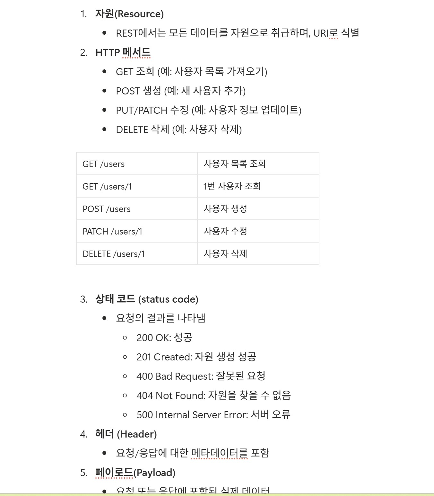

### 피어리뷰 - 유리의 워크북 캡쳐



### 제이 > 유리 피어리뷰

> HTTP 메서드 종류 및 각 메서드가 URI에서 어떻게 사용되는지 표로 작성하여 한 눈에 알아보기 좋았다. 또한 HTTP 메서드 요청에 대한 응답코드도 추가로 잘 정리를 하였다고 생각한다.

> 또한, 이번 2주차 API 명세서를 짜면서 상태 코드 200과 201의 차이점에 대해 알아본 적이 있는데, 200과 201, 400과 404를 구분하여 정리하신 부분이 눈에 띄었다.
---
# [미션 기록]
## 1. 홈 화면

| 종류 | 사용 |
|---|---|
| API Endpoint | GET /api/home |
| Request Body | X |
| Request Header | O (토큰 인증용) |
| Query Parameter | O (홈 화면 스크롤 기능 - 페이징) |
| Path Variable | X |
| Response Body | O |

### [Request Header] - 토큰 인증 필요
```http
Authorization : Bearer {AccessToken}
```

### [Query Parameter] - 홈 화면 스크롤
```
page=0&size=10

page : 0 (페이지 번호 - 0부터 시작)
size : 10 (페이지당 미션 수)
```

### [Response Body]
```json
{
    "isSuccess": true,
    "code": "COMMON200",
    "message": "홈 화면",
    "result": {
        "region": "안암동",
        "point": 999999,
        "missionCompletedCount": 7,
        "missionGoalCount": 10,
        "missionPoint": 1000,
        "missions": [
            {
                "dDay": 7,
                "missionCondition": "10,000원 이상의 식사시",
                "rewardPoint": 500,
                "storeName": "반이학생마라탕",
                "storeCategory": "중식당"
            },
            {
                "dDay": 7,
                "missionCondition": "10,000원 이상의 식사시",
                "rewardPoint": 500,
                "storeName": "반이학생마라탕",
                "storeCategory": "중식당"
            },
            {
                "dDay": 7,
                "missionCondition": "10,000원 이상의 식사시",
                "rewardPoint": 500,
                "storeName": "반이학생마라탕",
                "storeCategory": "중식당"
            }
        ]
    }
}
```

> 💡 실제 데이터는 `result` 안에 넣어서 묶음 (`isSuccess`, `code`, `message`와 구조 분리)

**데이터 꺼낼 때 차이**
- `response.isSuccess`
- `response.result.region`
---
## 2. 마이 페이지 리뷰 작성

| 종류 | 사용 |
|---|---|
| API Endpoint | POST /api/stores/{storeId}/reviews |
| Request Body | O |
| Request Header | O |
| Query Parameter | X |
| Path Variable | O ({특정 가게 Id}) |
| Response Body | O |

### [Request Header] - 토큰 인증 필요
```http
Authorization : Bearer {AccessToken}
Content-Type : application/json
```

### [Path Variable]
```
storeId : 1
```

### [Request Body]
```json
{
    "star": 4.5,
    "content": "너무 맛있어요!"
}
```

### [Response Body] - 리뷰 작성 직후 화면에 무엇이 보일까
```json
{
    "isSuccess": true,
    "code": "COMMON201",
    "message": "리뷰 작성 성공",
    "result": {
        "reviewId": 1,
        "createdAt": "2026-03-26T00:17:00"
    }
}
```

> 💡 리뷰 작성은 새 리소스 생성이니까 201 응답
> createdAt 포함 이유 : 내가 작성한 리뷰 페이지에서 작성일자 정보가 필요하기 때문
---
## 3. 미션 목록 조회 (진행중, 진행 완료)

| 종류 | 사용 |
|---|---|
| API Endpoint | GET /api/missions |
| Request Body | X |
| Request Header | O |
| Query Parameter | O (진행 중/진행 완료 상태 구분 + 스크롤) |
| Path Variable | X |
| Response Body | O |

### [Request Header]
```http
Authorization : Bearer {AccessToken}
```

### [Query Parameter]
```
?status=IN_PROGRESS&page=0&size=10
또는
?status=COMPLETED&page=0&size=10

status : IN_PROGRESS (진행중) / COMPLETED (진행완료)
page   : 0 (페이지 번호 - 0부터 시작)
size   : 10 (페이지당 미션 수)
```

### [Response Body] - 미션 목록에 무엇이 보일까
```json
{
    "isSuccess": true,
    "code": "COMMON200",
    "message": "미션 목록",
    "result": {
        "missions": [
            {
                "storeId": 1,
                "storeName": "가게이름a",
                "missionStatus": "COMPLETED",
                "missionCondition": "12,000원 이상의 식사를 하세요!",
                "rewardPoint": 500
            },
            {
                "storeId": 1,
                "storeName": "가게이름a",
                "missionStatus": "COMPLETED",
                "missionCondition": "12,000원 이상의 식사를 하세요!",
                "rewardPoint": 500
            },
            {
                "storeId": 1,
                "storeName": "가게이름a",
                "missionStatus": "COMPLETED",
                "missionCondition": "12,000원 이상의 식사를 하세요!",
                "rewardPoint": 500
            }
        ]
    }
}
```
---
## 4. 미션 성공 누르기

| 종류 | 사용 |
|---|---|
| API Endpoint | PATCH /api/missions/{missionId} |
| Request Body | X |
| Request Header | O |
| Query Parameter | X |
| Path Variable | O |
| Response Body | O |

> 💡 미션 상태만 부분 수정이므로 PATCH 사용

### [Request Header]
```http
Authorization : Bearer {AccessToken}
```

### [Path Variable]
```
missionId : 1
```

### [Response Body] - 미션 성공 버튼 누른 후 무엇이 보일까
```json
{
    "isSuccess": true,
    "code": "COMMON200",
    "message": "미션 성공",
    "result": {
        "missionId": 1,
        "missionStatus": "COMPLETED",
        "rewardPoint": 500
    }
}
```
---
## 5. 회원가입

| 종류 | 사용 |
|---|---|
| API Endpoint | POST /api/auth/users/signup |
| Request Body | O |
| Request Header | O |
| Query Parameter | X |
| Path Variable | X |
| Response Body | O |

### [Request Header]
```http
Content-Type : application/json
```

### [Request Body]
```json
{
    "terms": [
        { "termId": 1, "isAgreed": true },
        { "termId": 2, "isAgreed": true },
        { "termId": 3, "isAgreed": true },
        { "termId": 4, "isAgreed": true },
        { "termId": 5, "isAgreed": true }
    ],
    "name": "제이",
    "gender": "남",
    "birth": "2002-09-16",
    "address": "인천광역시 XX구 XX동",
    "preferFoods": [1, 3, 5]
}
```

### [Response Body] - 회원가입 성공 후 화면에 무엇이 보일까
```json
{
    "isSuccess": true,
    "code": "COMMON201",
    "message": "회원가입 성공",
    "result": {
        "memberId": 1,
        "name": "제이",
        "accessToken": "eyJhbGci...",
        "refreshToken": "eyJhbGci..."
    }
}
```

> 💡 COMMON200 vs COMMON201
>
> - `200` : 조회, 수정 등 성공
> - `201` : 리소스 새로 생성 성공