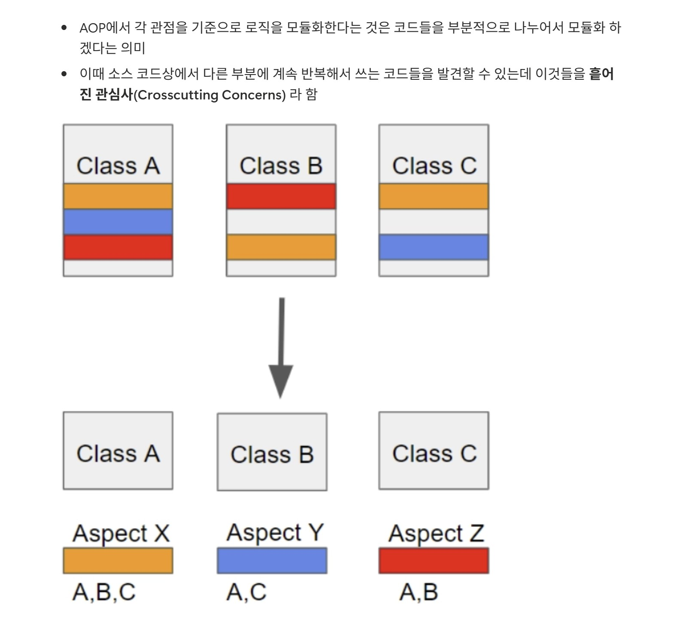
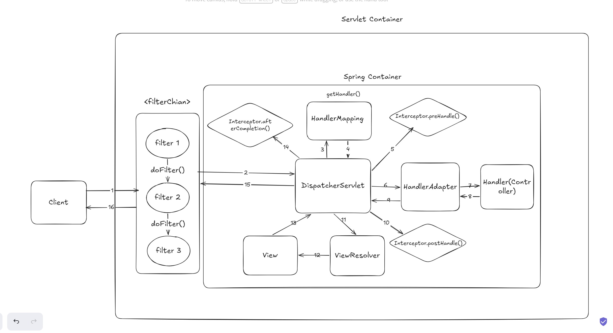

## 피어리뷰 - 유리의 워크북 캡쳐



## 제이 > 유리 피어리뷰

> AOP 개념이 낯설어서 텍스트만으로 이해하기가 좀 어려웠는데 그림을 통해 직관적으로 이해하는데 도움이 많이 됐습니다. 
> Class A, Class B, Class C에 반복해서 사용 중인 메서드를 색깔별로 구분해 놓았고, 이를 각 Class에서 완전히 분리하여 Aspect X, Aspect Y, Aspect Z로 묶고 각 Aspect 안에 사용하는 클래스 명을 정리한 그림이 인상 깊었습니다.

---
# [Spring 요청/응답 전체 흐름]


---

## 영역 1 : Servlet Container (Tomcat)
```
가장 바깥 영역. 클라이언트의 HTTP 요청이 가장 먼저 도착하는 곳.

**Tomcat** : Java 프로세스로 실행되는 서버.
TCP 소켓을 연결하고 클라이언트 요청이 오면 HTTP 메시지를 파싱해서
`HttpServletRequest`, `HttpServletResponse` 객체를 생성한다.

Tomcat이 `filterChain.doFilter()`를 호출하면 Filter들이 실행된다.
```
---

## 영역 2 : Filter Chain
```
Tomcat이 HTTP 메시지를 파싱한 후, Spring Container에 도달하기 전에 통과하는 영역.
Filter는 Spring 내부가 아닌 바깥 영역이다.

Filter Chain은 여러 Filter가 체인처럼 연결된 구조이다.
Filter 1 → Filter 2 → Filter 3 순서로 진행되고,
각 Filter 내부 `doFilter()` 메서드에서 `chain.doFilter()`를 호출해야 다음 Filter로 넘어가는 방식이다.
```
### Filter의 주 기능
```
- 인코딩 설정 (UTF-8)
- CORS 처리
- XSS 방어
- JWT 토큰 파싱 (Spring Security도 Filter 기반으로 동작함)

모든 Filter가 완료되면, 이 시점에 Tomcat이 `DispatcherServlet.service()`를 호출한다.
```
---

## 영역 3 : Spring Container

FilterChain을 모두 통과하고 Tomcat이 `service()`를 호출하면
Spring Container 속 DispatcherServlet으로 진입한다.
```
- `DispatcherServlet.doDispatch()` 시작
- `HandlerMapping.getHandler()` : "어떤 Handler가 처리할지 알려줘" → `HandlerExecutionChain` 반환 (Handler + Interceptor 목록)
- `Interceptor.preHandle()` : 인증/인가 체크 목적으로 사용 (`boolean` 값으로, `false`가 반환되면 Handler(Controller) 진입을 막음)
- `HandlerAdapter.handle()` : 파라미터 바인딩 진행 후 → Handler(Controller) 메서드 실행
- `Interceptor.postHandle()` : ModelAndView를 수정할 수 있는 단계 (REST API에서는 잘 안 씀)
- `ViewResolver` : Handler가 반환한 View 이름을 실제 템플릿 파일로 변환 후 렌더링 진행.
  만약 `@RestController`이면 ViewResolver 대신 MessageConverter가 동작한다.
  객체를 Jackson으로 JSON 직렬화해서 응답 바디에 사용함
- `Interceptor.afterCompletion()` : 모든 처리가 끝난 후 호출됨. 로그 기록 / DB 커넥션 반납 등에 사용
```
---

## Interceptor.afterCompletion() 완료 이후 → Client 이동 과정
```
afterCompletion()
↓
doDispatch() 종료
↓
service() 종료
↓
Filter N (chain.doFilter() 이후 코드 실행)  ← 역순 시작
↓
Filter 2 (chain.doFilter() 이후 코드 실행)
↓
Filter 1 (chain.doFilter() 이후 코드 실행)
↓
Tomcat이 HTTP 응답 메시지 작성 후 전송
↓
클라이언트
```