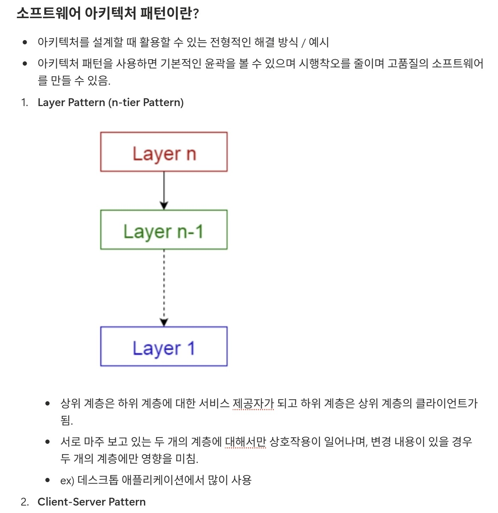

## 피어리뷰 - 유리의 워크북 캡쳐

## 제이 > 유리 피어리뷰

> 10가지 아키텍처 패턴을 각각 다이어그램과 실제 사용 예시까지 함께 정리해주셔서 이해하기 수월했습니다. 
> 특히 Broker Pattern, Blackboard Pattern 등 처음 보는 아키텍처가 많았는데 구성 요소를 하나씩 설명해주신 부분이 좋았습니다.
> 유리 덕분에 아키텍처 패턴 전반을 한 번에 훑어볼 수 있어 좋았습니다!