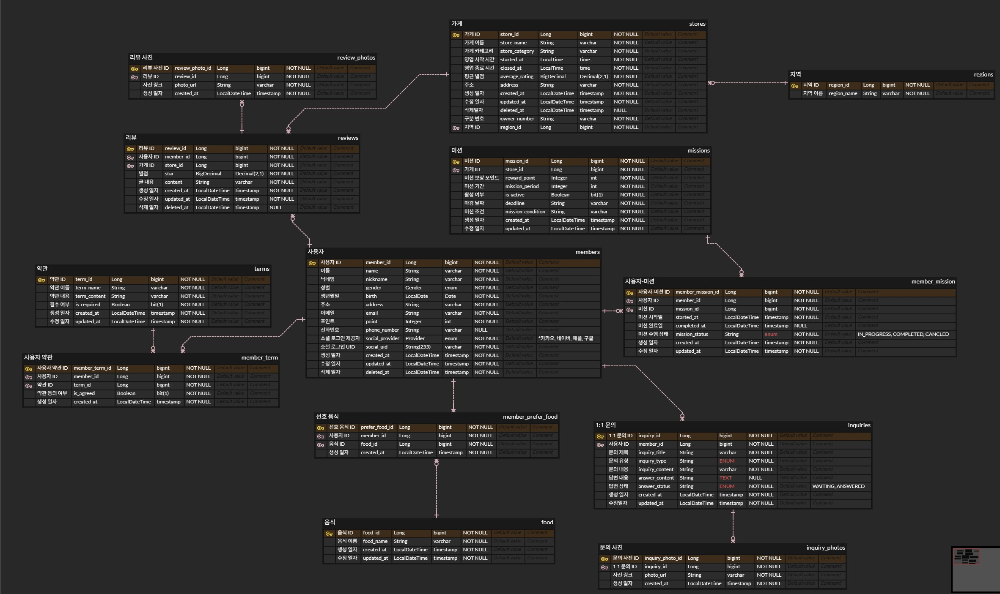

- (필수) 0주차 때 **직접 설계한** 데이터베이스를 토대로 아래의 화면에 대한 쿼리를 작성
    

  [0주차 erd 설계 수정 부분]

    - 미션 테이블 - ‘마감 날짜’ 속성 추가
    - 지역 테이블 & 지역 이름 속성 추가
    - 사용자-미션 테이블 ↔ 리뷰 테이블 연관관계 삭제



---
### 1. 리뷰 작성하는 쿼리, 사진의 경우는 일단 배제

```sql
INSERT INTO reviews (member_id, store_id, star, content, created_at, updated_at) 
VALUES (1, 2, 5, ‘음 너무 맛있어요’, NOW(), NOW());
```
리뷰 테이블에 [사용자 id, 가게 id, 별점, 리뷰 내용, 생성일자, 수정일자] 데이터를 넣는다.

### 2. 내가 진행중, 진행 완료한 미션 모아서 보는 쿼리(페이징 포함)

```sql
SELECT mm.member_mission_id,
       mm.mission_status,
       m.mission_condition,
       m.reward_point,
       s.store_id
FROM member_mission AS mm
         JOIN missions AS m ON mm.mission_id = m.mission_id
         JOIN stores AS s ON m.store_id = s.store_id
WHERE mm.member_id = 1	AND mm.mission_status = 'COMPLETED'
ORDER BY mm.started_at DESC
    LIMIT 10 OFFSET 0;
```
[미션 id, 미션 상태, 가게 id,미션 조건, 보상 포인트]
속성을 가져온다. 미션 테이블과 가게 테이블을 JOIN 하였고
미션 상태가 'COMPLETED'인 것을 WHERE 조건으로 넣었다.

### 3. 마이 페이지 화면 쿼리

```sql
SELECT m.nickname,
       m.email,
       m.phone_number,
       m.point
FROM members AS m
WHERE m.member_id = 1;
```
사용자 테이블에서 [닉네임, 이메일, 전화번호, 포인트] 데이터를 가져온다.
### 4. 홈 화면 쿼리 (현재 선택 된 지역에서 도전이 가능한 미션 목록, 페이징 포함)

```sql
SELECT COUNT(*)
FROM member_mission AS mm
         JOIN missions AS m ON m.mission_id = mm.mission_id
         JOIN stores AS s ON s.store_id = m.store_id
         JOIN regions AS r ON r.region_id = s.region_id
WHERE mm.member_id = 1
  AND mm.mission_status = 'COMPLETED'
  AND r.region_name = '안암동';

SELECT s.store_name,
       s.store_category,
       m.mission_period,
       m.mission_condition,
       m.reward_point
FROM missions AS m
         JOIN stores AS s ON s.store_id = m.store_id
         JOIN regions AS j ON j.region_id = s.region_id
WHERE r.region_name = '안암동'
ORDER BY m.deadline ASC
    LIMIT 10 OFFSET 0;
```
‘안암동’ 기준으로 카운트 쿼리를 통해 총 미션 개수 중 COMPLETED 미션 개수를 센다.

[가게 이름, 가게 카테고리, 보상포인트, 미션 데드라인, 미션 조건] 데이터를 가져온다. 이 쿼리 역시 ‘안암동’ 기준이며 성공 여부를 체크한다.
